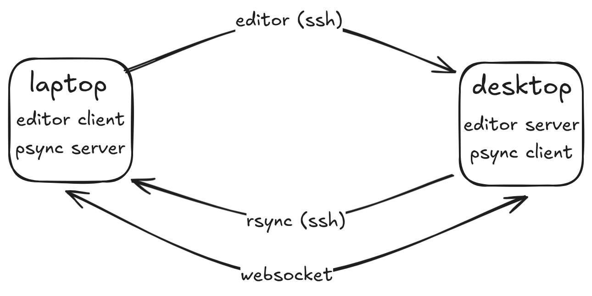

Usage
=====

Setup
-----

You will need to be able to reciprocally SSH into your target machines. The
below describes my setup, though you can set it up however you'd like.

The network should be secure. Psync messages are unencrypted, so I recommend
that you **do not expose your psync ports over the WAN**, and if you do, you
should only do so over a secure tunnel like `zerotier`_.

.. _zerotier: https://zerotier.com

Server
------

It is recommend to run the server in a docker container. This improves security
by isolating binaries and improves ease of setup. You can run the server
manually, or the server can be set up to run as a daemon on Linux with a simple
systemd service.

Docker setup
^^^^^^^^^^^^

First, create a directory for your docker-compose file, for example at
``/opt/psync``. This can be done as follows:

.. code-block:: bash

    # make the dir, create the compose file
    sudo mkdir /opt/psync
    sudo touch docker-compose.yml

    # optional: add psync user
    sudo useradd -Ms /usr/sbin/nologin psync
    sudo chown psync /opt/psync
    sudo chmod g+rw /opt/psync
    sudo usermod -aG psync $(whoami)
    newgrp psync

Then, generate your self-signed SSL certificate. Be sure to replace ``$MY_IP``.

.. code-block :: bash

    cd /opt/psync #or wherever
    # Generate a public/private keypair
    openssl req -x509 -newkey rsa:4096 \
        -keyout key.pem -out cert.pem \
        -sha256 -days 3650 -nodes \
        -subj "/C=XX/ST=StateName/L=CityName/O=CompanyName/OU=CompanySectionName/CN=$MY_IP" \
        -addext "subjectAltName=DNS:localhost,DNS:psync-server,IP:127.0.0.1,IP:$MY_IP"

Configure your docker container at ``opt/psync/docker-compose.yml``.

.. code-block:: yaml

    ---
    services:
        psync-server:
            image: ghcr.io/ada-x64/psync-server
            container_name: psync-server
            ports:
                - "5000:5000" # expose the psync websocket server
                - "5022:22" # expose the SSH server
            environment:
                # Required to accept connections from your client machine
                # I recommend allowing localhost / 127.0.0.1 here for testing
                - PSYNC_ORIGINS="client.ip.1 client.ip.2"
            volumes:
                - ./cert.pem:/app/cert.pem:ro
                - ./key.pem:/app/key.pem:ro
                - ~/.ssh/authorized_keys:/app/authorized_keys.src:ro

Importantly, **the SSH server is set up to only accept authorized keys.** This
should be your default anyways. Follow any guide to set up your SSH keys and SSH
server; this will automatically copy the authorized keys to the docker container.
Here's a simple way to do this:

.. code-block:: bash

    # It's best to provide a password when prompted.
    # You can avoid the hassle of typing it every time with `ssh-agent`.
    ssh-keygen -C psync -f ~/.ssh/psync.id_ed25519
    cat ~/.ssh/psync.id_ed25519 > ~/.ssh/authorized_keys

Be sure to keep track of the private key. You'll need to use this key every time you connect.

Refer to the :doc:`server documentation <generated/server.args>` for environment
configuration.

Daemon setup
^^^^^^^^^^^^

Next, create a systemd configuration file. I recommend storing this at
``etc/systemd/user`` so it runs on when the user session starts. Additionally, you should
create a new user with minimal permissions to run the service.

``/etc/systemd/user/psync.service``

.. code-block:: systemd

    [Unit]
    Description=Psync Daemon
    After=network-online.target
    Wants=network-online.target

    [Service]
    Restart=on-failure
    RestartSec=1

    ExecStart=/usr/bin/docker compose -f /opt/psync/docker-compose.yml up
    WorkingDirectory=/opt/psync

    # You may need to relax these restrictions
    ProtectSystem=full
    PrivateTmp=true
    NoNewPrivileges=true

    [Install]
    WantedBy=default.target

Next, run ``systemctl --user start psync; systemctl --user enable psync``. It's
useful to run ``journalctl --user -fu psync`` to verify the system status.

Graphical Server
^^^^^^^^^^^^^^^^

In addition to CLI-based projects, psync supports graphical setups. Here is an
example of how to use the ``psync-graphical-server`` docker container.

.. code-block :: yaml

    services:
        psync-server:
            image: ghcr.io/ada-x64/psync-graphical-server
            container_name: psync-server
            ports:
                - "5000:5000"
                - "5022:5022"
            environment:
                - "PSYNC_ORIGINS=${MY_ORIGINS} 127.0.0.1 localhost"
                # These are needed in order to set up an X / wayland server.
                # You should double-check the values of these environment variables.
                - "XDG_RUNTIME_DIR=${XDG_RUNTIME_DIR:-/run/user/1000}"
                - "WAYLAND_DISPLAY=${WAYLAND_DISPLAY:-wayland-0}"
                - "XDG_SESSION_TYPE=wayland"
            volumes:
                - ./cert.pem:/app/cert.pem:ro
                - ./key.pem:/app/key.pem:ro
                - /home/ada/.ssh/authorized_keys:/app/authorized_keys.src:ro
                # Sync the wayland session.
                - "${XDG_RUNTIME_DIR}/${WAYLAND_DISPLAY}:${XDG_RUNTIME_DIR}/${WAYLAND_DISPLAY}"
                #  You may need to do this manually when setting up a systemd daemon.
                # - /run/user/1000:/run/user/1000
            group_add:
                # Give psync access to your gpu.
                # You may also need to add group `render`.
                - video
            devices:
                # Sync your sound and graphics devices.
                - /dev/snd:/dev/snd
                - /dev/dri:/dev/dri

For more advice on how to set up an X11/Wayland accessible Docker container, see
the `x11docker wiki`_

.. _x11docker wiki: https://github.com/mviereck/x11docker/wiki

Client
------

The client is intended to be invoked as a CLI script. First, you will need to install it.
Use your favorite package manager. I use uv.

.. code-block :: bash

    uv tool install cubething_psync

Then, you should be able to access it from the command line.

.. code-block :: bash

    psync-client --help

Refer to the help command and the :doc:`api docs <./generated/client.main>` for
more details.

**You will need to manually add a certificate to trust the server.** Copy the
certificate you generated for the server to your client machine at
``~/.local/share/psync``. If you want to use a different directory, set it using
the ``PSYNC_CERT_PATH`` environment variable.

I also recommend placing your ``PSYNC_CLIENT_IP`` (etc.) in ``~/.profile``.
